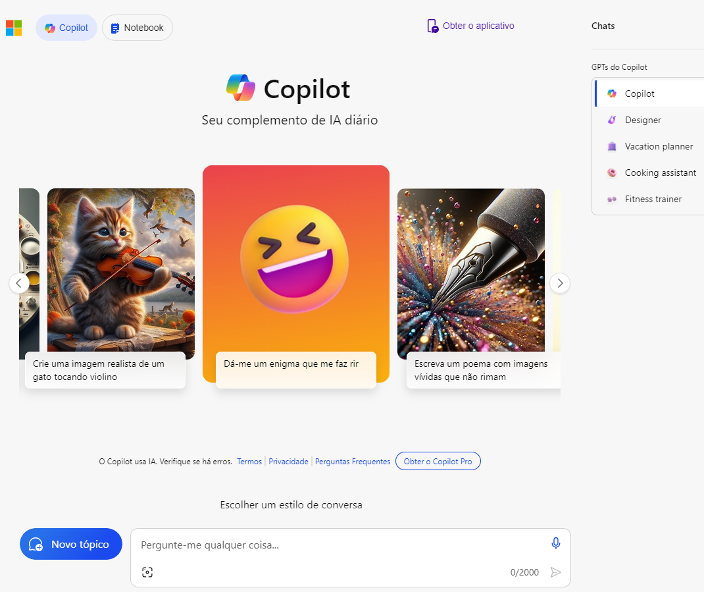
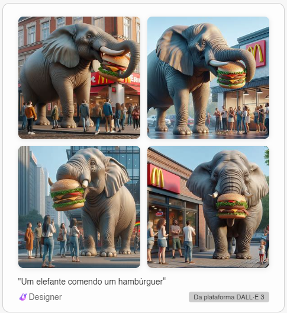

# Aula: Explorando os Recursos de IA Generativa com Copilot e OpenAI

Links Importantes:

* [Explore generative AI with Microsoft Copilot](https://microsoftlearning.github.io/mslearn-ai-fundamentals/Instructions/Labs/12-generative-ai.html)
* [Explore Azure OpenAI](https://microsoftlearning.github.io/mslearn-ai-fundamentals/Instructions/Labs/13-azure-openai.html)
* [Explore content filters in Azure OpenAI](https://microsoftlearning.github.io/mslearn-ai-fundamentals/Instructions/Labs/14-azure-openai-content-filters.html)

## Explorando a IA Generativa com o Microsoft Copilot

### Logar no Microsoft Copilot

* Abrir o endereço https://copilot.microsoft.com/ e se logar com a sua conta pessoal
* O Microsoft Copilot usa IA generativa para melhorar os resultados de busca do Bing, isso quer dizer que os resultados podem variar conforme novas respostas são incorporadas ao modelo de linguagem natual.
* Próximo ao final da tela, você verá uma caixa de texto dizendo "Pergunte-me qualquer coisa...". Assim que você começar a entrar com prompts de comando, o Copilot irá retornar os resultados na thread.

### Use prompts para gerar respostas

* Digite o prompt: "Quais são os 3 prós e contras de se viajar no inverno?". Você verá o "Procurando por..." e "Gerando...". [Resultado obtido:](../output/explorando-ia-response01.txt).
* Digite depois o seguinte prompt: "Me encontre mais 3 prós". [Resultado obtido.](../output/explorando-ia-response02.txt).
* Digite agora o seguinte prompt: "Quais são os 3 lugares que eu posso ir para encontrar menos multidão no Brasil e sendo no inverno?". [Resultado obtido.](../output/explorando-ia-response03.txt).
* O botão **Novo tópico** próximo à janela de chat é útil para limpar a conversa anterior e com isso as respostas não serão baseadas na conversa anterior. Clique no botão **Novo tópico** e veja o que acontece. Resultado:

### Tente agora a geração de imagens

* Digite o prompt: "Crie uma imagem de um elefante comendo um hambúrguer".
* Irá aparecer uma mensagem dizendo que a imagem está sendo gerada.
* Resultado obtido:

* Verifique que as imagens podem parecer similares mas não as mesmas do exercício oficial. Isto ocorre porque as respostas variam.
* Na parte debaixo das imagens, aparece um texto dizendo: "Da plataforma DALL-E 3". Considere como DALL-E é baseado em modelos de linguagem grandes como sua entrada de linguagem natural e gera imagens.

### Tente agora a geração de código

* Digite o seguinte prompt: "Use Python para criar uma lista.". [Resposta](./output/lista-em-python.pdf).
* Digite o seguinte prompt: "Traduza isto para C#.". [Resposta](./output/lista-em-csharp.pdf).
* Tarefa bônus. Digite o seguinte prompt: "Quais são 3 exemplos de IA generativa ajudando pessoas?". [Resposta](./output/ia-generativa-ajudando-pessoas.pdf).

## Explorando o Azure OpenAI

Neste exercício não será possível efetuar o teste pois só está liberado para clientes da Microsoft que possuam endereço de e-mail comercial.

De qualquer forma, os passos são os seguintes:

### Pré-requisitos

* Fazer a assinatura free no portal Azure acessando https://azure.microsoft.com/free
* Requisitar acesso passando dados da empresa cliente em https://aka.ms/oaiapply

### Provisionar um recurso do Azure OpenAI

* Entrar no portal Azure.
* Criar um recurso Azure OpenAI, adicionando a um resource group, região East US, Pricing Standard S0.
* Executar o deploy

### Explorar o Azure OpenAI Studio

Você pode fazer deploy, gerenciar e explorar modelos no Azure OpenAI Service usando o OpenAI Studio.

* Abrir o Azure OpenAI Studio pelo link https://oai.azure.com/
* Fazer deploy de um modelo para geração de linguagem
* Usar o Chat playground para trabalhar com o modelo
* Usar o DALL-E playground para gerar imagens

Ao final do processo fazer a limpeza do grupo de recursos.

## Explorando filtros de conteúdo no Azure OpenAI

### Pré-requisitos

* Fazer a assinatura free no portal Azure acessando https://azure.microsoft.com/free
* Requisitar acesso passando dados da empresa cliente em https://aka.ms/oaiapply

### Provisionar um recurso do Azure OpenAI

* Entrar no portal Azure.
* Criar um recurso Azure OpenAI, adicionando a um resource group, região East US, Pricing Standard S0.
* Executar o deploy

### Fazer deploy de um modelo

* Executar os passos do exercício se você tiver uma conta

### Gerar a saída da linguagem natural

* Executar os passos do exercício se você tiver uma conta

### Explorar os filtros de conteúdo

* Executar os passos do exercício se você tiver uma conta

Ao final do processo fazer a limpeza do grupo de recursos.
